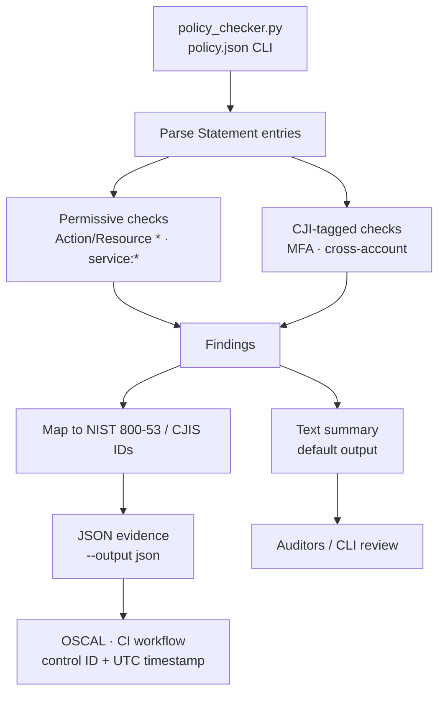

[](https://github.com/0xBahalaNa/policy_checker/actions/workflows/policy-check.yml)

# Policy Checker

This script loads an AWS IAM policy file and checks if it is overly permissive.

## Architecture Overview



Editable Mermaid source (kept in sync with the fence above): [`docs/architecture.mmd`](docs/architecture.mmd).

`policy_checker.py` parses each IAM `Statement` and flags overly permissive wildcards and CJI-tagged MFA / cross-account gaps. Default output is a text summary with severity, statement ID, and message (control IDs are omitted). With `--output json`, findings are enriched with NIST 800-53 / CJIS control IDs and UTC timestamps for CI and OSCAL consumers.

## Usage
```
python policy_checker.py <filename> [--output text|json]
```

### Examples
```
python policy_checker.py policy.json
python policy_checker.py policy.json --output json
python policy_checker.py policy.json --output json > results.json
```

## What It Does
- Loads a JSON policy file.
- Iterates over the `Statement` entries.
- Checks for excessive permissions such as:
    - `Action` is `*`
    - `Resource` is `*`
    - Service-level wildcards (e.g., `s3:*`, `iam:*`)
- Performs CJIS v6.0 checks on CJI-tagged resources:
    - Missing MFA condition (`aws:MultiFactorAuthPresent`)
    - Cross-account access without org restriction
- Maps findings to NIST 800-53 and CJIS v6.0 compliance controls.
- Prints a summary of the results.

## Compliance Mapping

Each check maps to controls across NIST 800-53 Rev 5, FedRAMP, and CJIS v6.0:

| Check | NIST 800-53 | FedRAMP | CJIS v6.0 |
|-------|-------------|---------|-----------|
| Action is `*` | AC-6 (Least Privilege) | AC-6 | AC-6 |
| Resource is `*` | AC-3 (Access Enforcement) | AC-3 | AC-3 |
| Service-level wildcard (e.g., `s3:*`) | AC-6 (Least Privilege) | AC-6 | AC-6 |
| Overly permissive IAM policy | AC-2 (Account Management) | AC-2 | AC-2 |
| CJI resource access without MFA | IA-2 (Identification and Authentication) | IA-2 | IA-2 |
| Cross-account access to CJI resource | AC-2 (Account Management) | AC-2 | AC-2 |

## Audit Relevance

The JSON output (`--output json`) provides machine-readable evidence for compliance assessments. Auditors can use this output to verify CM-6 (Configuration Settings), CM-7 (Least Functionality), and SA-11 (Developer Testing) controls. Each finding includes the compliance framework, control ID, severity, and a UTC timestamp for audit trail purposes.

## FedRAMP 20x Alignment

FedRAMP 20x requires compliance controls to be validated through automated, machine-readable evidence rather than manual documentation. The `--output json` format produces structured findings that can feed directly into OSCAL-based evidence pipelines. Each finding includes the framework, control ID, severity, resource, and UTC timestamp required for continuous monitoring and authorization packages.

## CJIS v6.0 Relevance

CJIS v6.0 (published Dec 27, 2024; default audit baseline from April 1, 2026; Priority 2-4 fully enforceable Oct 1, 2027) aligns with NIST 800-53 Rev 5 but adds requirements specific to systems handling Criminal Justice Information (CJI). This tool validates that IAM policies enforce least privilege (AC-6), access control enforcement (AC-3), and MFA requirements (IA-2) for CJI resources, helping agencies demonstrate that AWS permissions governing CJI data stores are scoped appropriately.

## Output Formats

### Text (default)
Human-readable output for terminal use.
```
Checking: test-policy.json
[FAIL] Statement "DangerousAdmin01": Action is "*"
[FAIL] Statement "DangerousAdmin01": Resource is "*"
[FAIL] Statement "CJIAccessNoMFA": CJI resource access without MFA condition (aws:MultiFactorAuthPresent)
[WARN] Statement "CJICrossAccount": Cross-account access to CJI resource without org restriction

Results: 4 issues found.
```

### JSON (`--output json`)
Structured output for automation and compliance pipelines. Each finding includes `framework`, `control_id`, `finding`, `severity`, `resource`, and `timestamp`.
```json
[
  {
    "framework": "NIST 800-53",
    "control_id": "AC-6",
    "finding": "Action is \"*\"",
    "severity": "FAIL",
    "resource": "test-policy.json",
    "timestamp": "2026-02-14T12:00:00+00:00"
  }
]
```

## Testing
```
python -m pytest tests/ -v
```

## Requirements
- Python 3.x

## License
- MIT License
